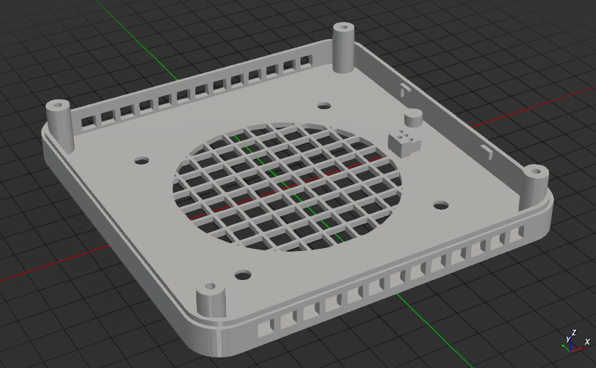
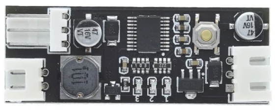

# Name

UM690 bottom case with PWM



PWM module 12V


# Requirements

- BOSL2

# Make

```bash
# case with PWM module
openscad -D with_pwm=true  -o UM690_v3_PWM.stl UM690_v3.scad

# case without PWM module
openscad -D with_pwm=false -o UM690_v3.stl UM690_v3.scad

# pwm case
openscad -o PWMv12_case.stl pwm12v.scad
```

# Description

Minisforum UM690 and UM690 case for 8010 cooler with PWM controller.
The air flow is optimal for memory and NVME cooling.

PWM controller [12V 0.8A DC PWM](https://aliexpress.ru/wholesale?SearchText=12v+0.8a+dc+pwm&g=y&page=1&searchInfo=AyyakNmNET%2FHA5H34vRlDVHWQKYKD++wMPbL67mcjNWuY5U8MXYcrUVJ%2Fq17k5VjWzamH7sLXOaiUdXGaLlSlYLkHp9XzzjO5MXq2%2FtFfrgrUAcB1HLZD7aLwlxYzWF3eb7aPd7UqSaX2rR9hN9mZksvKsBAUmfqakHoNHmu4eyIs44Ita2yCwhs)

Source code OpenSCAD https://github.com/WorldException/UM690_bottom_case

